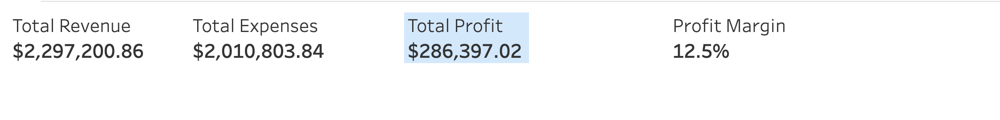
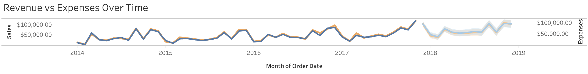
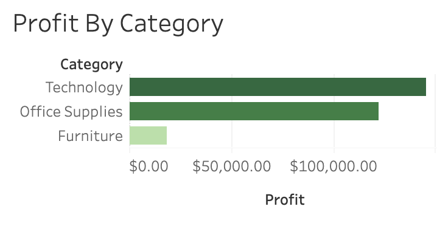
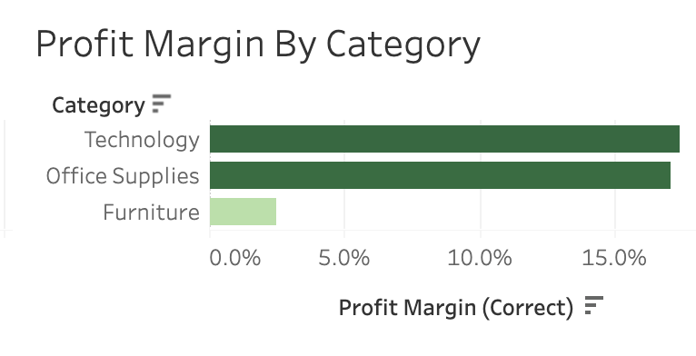

# Financial Performance Dashboard

## Overview

This project presents an executive-style financial dashboard built in Tableau to analyze business performance through revenue, expenses, profit, and profit margin. The dashboard is designed to transform transactional financial data into actionable insights that support strategic decision-making.

## Use Case

This dashboard is intended for:

- Business stakeholders reviewing financial performance
- Analysts monitoring profitability and cost trends
- Leadership teams evaluating revenue growth and operational efficiency

## Business Questions

This dashboard answers the following questions:

- Is the business growing revenue over time?
- Are expenses increasing at a sustainable rate?
- Is the business operating profitably?
- Which categories contribute the most to profit?
- Which categories generate the highest profit margins?

## Dashboard Metrics

The dashboard includes the following key performance indicators (KPIs):

- Total Revenue
- Total Expenses
- Total Profit
- Profit Margin

These KPIs provide a high-level summary of overall financial performance.

---

## Dashboard Walkthrough

### KPI Summary

Provides an executive snapshot of the organization's overall financial health.



---

### Revenue vs. Expenses Over Time

Compares revenue and expenses over time to identify growth trends and monitor cost control.



---

### Profit by Category

Highlights which business categories contribute the most profit.



---

### Profit Margin by Category

Compares profitability across categories by measuring profit relative to revenue.



---

## Key Insights

This dashboard enables users to:

- Monitor financial performance over time
- Compare revenue growth against operating expenses
- Identify the most profitable business categories
- Evaluate category efficiency using profit margin
- Support data-driven financial decision-making

## Dataset

The dashboard is built using financial transaction data containing:

- Date
- Category
- Revenue
- Expenses
- Profit
- Profit Margin

### Data Assumptions

- Profit is calculated as Revenue minus Expenses.
- Profit Margin is calculated as Profit divided by Revenue.
- Category represents a business segment or product line.
- The dataset is intended for analytical demonstration purposes.

## Tools Used

- Tableau Desktop
- Tableau Public
- Microsoft Excel (data preparation)
- GitHub

## Future Improvements

Potential enhancements include:

- Regional financial analysis
- Interactive parameter controls
- Budget vs. Actual comparisons
- Revenue forecasting
- Connection to a live data source

## View the Dashboard

**Interactive Tableau Dashboard:**  
[Financial Performance Dashboard on Tableau Public](https://public.tableau.com/app/profile/brian.sentz/viz/FinancialPerformanceDashboardRevenueMarginandBusinessHealthMonitoring/FinancialDashboardFinancialPerformanceDashboardRevenueMarginandBusinessHealthMonitoring)

---

## Repository Structure

text'''
financial-dashboard/
│
├── README.md
├── images/
│   ├── kpi.png
│   ├── trend.png
│   ├── profit_category.png
│   └── profit_margin.png
```
